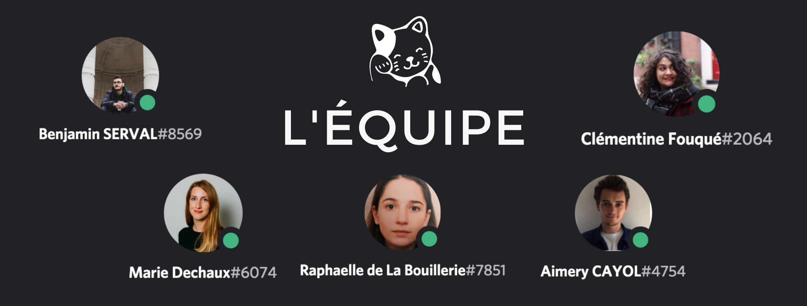

# Bicrave Ton Chaton 🐱

## Pitch
Pour le projet, nous avons créé une boutique en ligne, pour un magasin de photos de chatons. La boutique affiche les différents produits, les clients peuvent s'inscrire, remplir leur panier, et payer l'objet avec Stripe pour le recevoir par email.

## Version minimaliste
Nous avons codé une boutique en ligne, qui vend des photos de chatons. La page d'accueil du site comprend la liste des produits qui sont à vendre, grace à un seed. Un visiteur peut cliquer sur l'un des produits pour l'afficher et avoir plus de détails sur le produit. Le visiteur doit s'inscrire pour ajouter ce produit à son panier.

Un utilisateur peut accéder facilement à son panier, modifier la quantité de produits à acheter, puis accéder au checkout pour payer. Il paiera via Stripe le total, il recevra un email avec la·les photo·s de chaton·s. L'administrateur du site recevra aussi un email avec le récapitulatif de la commande qui vient d'être passée.

## lien de l'app en production : 
https://bicrave-ton-chaton.herokuapp.com/

## Contributeurs :
- [Clémentine FOUQUE](https://github.com/Clem-svg)
- [Raphaëlle de La BOUILLERIE](https://github.com/raphaelledlb)
- [Benjamin SERVAL](https://github.com/BenjaminServal)
- [Aimery CAYOL](https://github.com/Aimery-Cayol)
- [Marie DECHAUX](https://github.com/mariedx) 

